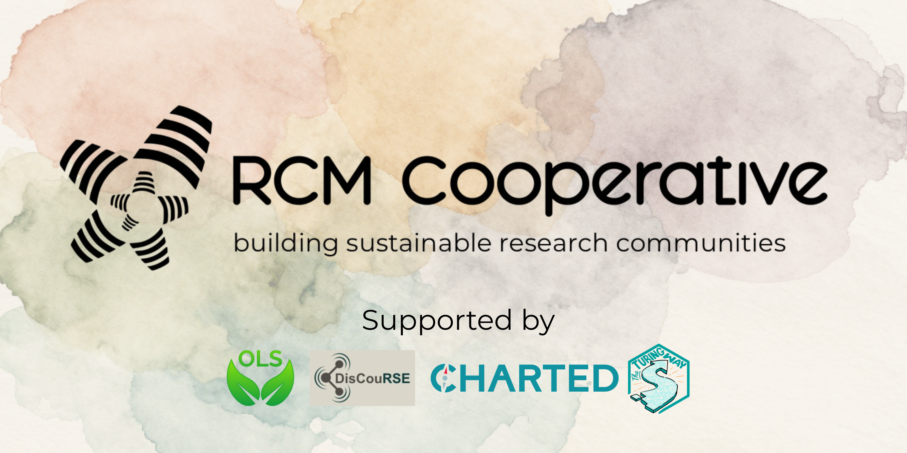


# RCM Cooperative Monthly Meet-up (2026-09-15)

<mark>This is an archive of the collaborative session notes. Attendee emails have been redacted (except for organisers). All other information has been reviewed and accepted for public sharing.</mark>

**PRIVACY NOTICE**
- These notes are public but not indexed (will not show up in an internet search).
- Do not include any confidential information or anything which could cause reputational harm. 
- Information will be extracted from these notes to monitor our engagement and community needs.
- Extracted information will be shared with administrators and leadership of RCM Cooperative.
- Data will be stored in line with UK GDPR.

---

**Call recording:** https://www.youtube.com/watch?v=WLXVTYqFAsc

<mark>Actions are highlighted</mark>

  
Expand for Contents

    <ul>
      <li><a href="#attendees">Attendees</a>
      <li><a href="#notes">Notes</a>
    </ul>

<!-- %%%%%%%%%%%%%%%%%%%%%%%%%%%%%%%%%% -->
> 
> **Guide to Markdown - https://www.markdownguide.org/getting-started/**
> **Markdown cheatsheet - https://www.markdownguide.org/cheat-sheet/**

## Attendees
(Name / Pronouns (optional) / Primary affiliation / Email / Github) 

- Alexandra Araujo Alvarez, She/Her, The Turing Way, <mark>email redacted</mark> / AlexandraAAJ
- Emma Karoune, she/her, RCM Cooperative, emma.karoune@rcmcooperative.com/ EKaroune
- Eirini Zormpa / she/her / Imperial College London / <mark>email redacted</mark> / @eirini-zormpa
- Cassandra Gould van Praag / she/her / RCM Cooperative / cassandra.gouldvanpraag@rcmcooeprative.com / @cassgvp
- Heleri inno, She/Her / ELIXIR Estonia / <mark>email redacted</mark>
- Deborah (Debs) Udoh, she/her, EMBL Heidelberg / <mark>email redacted</mark> @npdebs on GitHub
- Simona Gioè, she/they / EMBL Heidelberg / <mark>email redacted</mark> / @simona-gioe
- Danny, they/them, Digital Research Academy, <mark>email redacted</mark>, @da5nsy
- Dan Rudmann / He, Him / Utrecht University / <mark>email redacted</mark>
- Samira Bouyagoub, University of Sussex / <mark>email redacted</mark>
- Christina McDonald / She/Her / BIOMEDASA, University of Liverpool / <mark>email redacted</mark>
- Mary Miedema / she/her / Douglas Research Centre, <mark>email redacted</mark> / Physiopy, <mark>email redacted</mark>
- Samantha Wittke / she/her / CSC - IT Center for Science (FI) / <mark>email redacted</mark> / samumantha
- Fotis Psomopoulos/ he.him / INAB|CERTH (GR) / <mark>email redacted</mark>
- Jeremy Cohen / he/him / Imperial College London / <mark>email redacted</mark>
- Emily Lumley / she/her / Imperial College London / <mark>email redacted</mark>
- Bethan Iley / she/her / OLS / <mark>email redacted</mark> / bethaniley
- Lucy Wheeler / she/her / Imperial College London - <mark>email redacted</mark>
- Precious Onyewuchi / she/her/ DSWB, OSPO Now / <mark>email redacted</mark>/ @preshh0
- Malvika Sharan / she/her / St. Jude / <mark>email redacted</mark> 
- Meag Doherty / she/her / Both and Neither Studio / <mark>email redacted</mark> / @meagdoh
- Ensar Acem / he/him / Kadir Has University / <mark>email redacted</mark> / <mark>email redacted</mark>
- Arielle Bennett / She/her / The Alan Turing Institute, The Turing Way / <mark>email redacted</mark> 
- Sarah Jaffa / she / University of Manchester, UK / <mark>email redacted</mark>
- Annayah M.B. Prosser /she/her/ University of Bath, UK / <mark>email redacted</mark> / https://www.linkedin.com/in/annayah-prosser-b966639b/ / https://bsky.app/profile/annayahprosser.bsky.social
- Toba Olatoye / he / him/ Kwara State Teaching Service Commission / Nigeiria/ <mark>email redacted</mark>
- Eleanor Broadway / She/her / EPCC, University of Edinburgh / <mark>email redacted</mark>
- Adam Partridge /he/him / Trinity College Dublin & FORRT / <mark>email redacted</mark>
- Manisha Sinha / she/her / Neuromatch / <mark>email redacted</mark>
- Sophie Whittle / she/her / University of Sheffield / <mark>email redacted</mark>
- Tanya Payne/ she/her/ Wild Animal Initiative/ <mark>email redacted</mark>
- Jenny McHugh / she/her/ UK-Ireland Digital Humanities Association / <mark>email redacted</mark>
- Oscar Seip / he/him / Institute for Research Software - University of Manchester / <mark>email redacted</mark>
- James Robinson / he/him / The Alan Turing Institute / <mark>email redacted</mark> / @jemrobinson
- Isha Sharma / she/her / Manchester University NHS foundation Trust (MFT) <mark>email redacted</mark>
- Francesco Santini / he/him / University of Basel (Switzerland) / https://github.com/fsantini/ / <mark>email redacted</mark>
- Andrew Porter / he/him / Cancer Research UK Manchester Institute, University of Manchester / <mark>email redacted</mark>

## Notes

### Icebreaker - Learn about who's here

#### Instructions for Breakout groups
- Desk treasure hunt! - 2 mins
- Go to break out room - 10 mins
- Introduce yourself - who you are and what you do
- Show and discuss your treasures!

#### Desk treasure hunt
> **2 mins to find:**
>- Something yellow
>- A book
>- Something natural

#### Group notes:
* Lucy & Yak who make excellent comfy clothes have recently become a worker-owned cooperative.

### Discussion

>**10 mins in breakout group**
>1. Do you see yourself fitting into the membership structure? Why/Why not?
>2. What benefits or incentives would be valuable to you for being a community or core member?

#### Membership requirements
- Community membership will be offered to anyone who has either:
1. Attended at least two events in a year, and/or;
2. Demonstrated sustained engagement and contribution to RCM Cooperative the via our communication channels for a minimum of three months.

- Core membership will be offered to anyone who has:
1. Contributed for a minimum of six months toward a Co-Op deliverable; and/or 
2. Shown consistent active engagement and contribution to our community workspaces for a minimum of six months.

- Once the membership offer is accepted, it is valid for 1 year. 

Looks amazing! Out of curiosity, how would an RCM Coop deliverable look like?

#### Breakout group notes:
**Group 1:**
>1. Do you see yourself fitting into the membership structure? Why/Why not?

All group members felt that they would fit in to the membership structure and that it provides a good way to ensure that people are engaged with the community and remain involved.

Desire vs enthusiasm :) - would love to be core - but capacity might be for community

Want to start with community role and would like to later assess capacity to join the core

>2. What benefits or incentives would be valuable to you for being a community or core member?

- Interested in learning from peers
- Training and knowledge sharing
- Community
- Capacity is a barrier for core membership at this point
- It's nice to have a place where we get supported instead of always supporting others
  - Templates, resources, guidane, support to do community management in a systematic way
- Feel like these roles are increaingly less incentivised or recognised with narrative moving to AI -- really want to learn and connect with others on how to weave community management in existing technical roles
- Access to resources, calls and support from others and "blow off some steam" when work gets tough
- Incentive will also include gaining skills in areas where current job doesn't allow - like teaching, writimf
- Find ways to protect voices of people who care about community management and shared voices which are in danger with increasing use iof AI (where anyone can pretend to know anything and assume that these roles are not required)

**Group 2:**

**Group 3:**

Manisha, Jenny and 
>1. Do you see yourself fitting into the membership structure? Why/Why not?

Community membership feels sustainable alongside usual responsibilities. Two events a year is quite a low barrier!

It may be difficult to be a core member due to contract restrictions. Different situations in the group, some could choose to use their allowed volunteer hours whereas others are fully subscribed. 

Large gap between the two tiers, could it be more fine-grained? Providing case studies of different examples would be really great - what activities are the RCM core members involved with? We saw an example of 1 deliverable, more fleshing out of the core member responsibilities would be helpful to make a decision between the tiers. 

The tiered decision-making seemed like a great idea. 

>2. What benefits or incentives would be valuable to you for being a community or core member?

Training! Community! 

Sending invites to events - spreading the word - cross-pollination - reaching new audiences

A clinic-style session where you can join to share community management problems and workshop solutions

**Group 4:** 
Will Gawned, Maryblessing Okolie, Bethan Iley, Emily Lumley

We had two people who would want to be community and 2 people who would want to be core, which suggests the structure is sensible.
- Core and Community begin with the same letter, so it's a bit confusing! We mixed them up!

Questions about structure:
- What happens if our role/capacity changes? Would we lose member status?
- What about operations roles? The project focus seems to prioritise deliverables. The people who are doing background work (ops) that supports communities might not qualify for core membership unless this is clearly defined as in scope.

Benefits
- Community is useful to get insights, connections, job opportuntiies

Unclear where the money for this work is coming from. The funding landscape is depressing at the moment :(

**Group 5:**
Members- Annayah Prosser (AP), James Robinson (JR), Sophie Whittle (SW)
>1. Do you see yourself fitting into the membership structure? Why/Why not?

Initially part of the community. Covering for someone else so don't want to commit for them.
Similarly, capacity depends on teaching commitments.

Shifting contributions over time as capacity allows?
AP- Six months working schedule could pose issues, especially for those on casual contracts, I have significant teaching responsibilities that would hinder my capacity to contribute consistently across six months, but across a year I could if that makes sense? six months may be too short a timescale to judge core membership.

How long would a contribution entitle one to 'core' membership? What if someone makes a large contribution in a short time?

Most of us see ourselves in the community (at least initially)
Could there be another category for folks who want to join some sessions without voting/contribution pressure? Like a participant/audience class for folks who want to attend sessions?

Tangible outputs and benefits to 'core' membership need to be clarified, what kinds of things would we vote on? What sort of impact would that have

Interested in the idea and support the concept but don't do this day-to-day, skillset mismatch, prioritisation

>2. What benefits or incentives would be valuable to you for being a community or core member?

Being in a community with shared problems/questions.
Shared solutions.

Benefits:
- Engaged community, minimising duplication of efforts
- Fast-tracking community development, especially start up
- Sharing best practice and opportunities
- Giving words to the labour we do, building solidarity together
- We are already here, just not labelling ourselves as such, a lot of the hard work is already done
- Expanding our community activities/protocols/guidance
- Information and best practice sharing- kits for different stages of community management, e.g. starting, maintaining, closing (with grace)

**Group 6:**

>1. Do you see yourself fitting into the membership structure? Why/Why not?

General interest in fitting in as Community members - depending on time zone, depending on capacity

Time zone may be a barrier even when community membership is aligned with what people are interested in

Duration of community management positions may also make longterm contributions difficult.

Aligns with my work activities, a project coming up with CoP development task. But also having a slight confusion what the cooperative does. 

Concerns about overreach, not having capacity for further involvement

Nature of the role (i.e. RCM roles) is cooperative, but very easy to over-commit (we agreed as a group that this tends to be a barrier)

>2. What benefits or incentives would be valuable to you for being a community or core member?

Creating spaces for discussion/sharing opportunities are a good incentive.

Discussions and knowledge-sharing aligned with interests (e.g. sustainable community building)
- request for further clarity on what the community and core members are and how they relate to each otherCo-operative model looks useful

If it alignes with your work and tasks, easier to put effort in it. 

Community manager more official role, would be easier to participate. Open science community manager more known, but still quite undefined role. 

Another incentive would be to have this group in clear relation to/in support of/aligned with other similar groups, rather than siloed as its own thing.

**Group 7:**

>1. Do you see yourself fitting into the membership structure? Why/Why not?

- FP: Probably yes. It's a really unique structure, and I'd be quite keen to engage. Probably more as a community member rather than a core member (due to time constraints primarily). But ultimately depends on the activity / deliverable itself... :)

- Ensar Acem: Probably yes. Seems fun and friendly!

>2. What benefits or incentives would be valuable to you for being a community or core member?

- FP: For working together on common challenges in community management, exchange ideas/best practices.

- Ensar Acem: Co-projects and co-authorships in papers.

- For the time being, i would be a community member, and with time i may participate as a core member. (Toba Olatoye)

**Group 8:**
>1. Do you see yourself fitting into the membership structure? Why/Why not?
* Yes, see the benefits of coming together as a community to share knowledge and expertise 
* Membership model looks great, interested to see it in practice 
* There's a lot of engagement tracking, how will this (data) be handled? 
* Is it problematic to have a 50% quorum? Is that realistic? How to account for asynchronous engagement. 
* How to distinguish between members if not through taking on responsiblities by sitting on working groups, steering committees, etc.

>2. What benefits or incentives would be valuable to you for being a community or core member?
* Sharing experiences around community management
* The community seems it'll be very inclusive
* Working groups or committee etc 
* Give people opportuinities early to empower members (have rotating facilitators, pitch collabs/applications)
* Possible career pathways and growth.

**Group 9:**

**Group 10:**

**Group 11:** Cass, Danny
- Who/what is Board
  - Currently Directors and [Governancy/Advisory committee](https://github.com/rcmcooperative/governance/blob/main/committees.md)
- Difference between Director vs Core member
  - Directors lead strategy, but any formal proposals would have to go through vote (or governance committee until voting/membership processes agreed)
- Who can make a proposal
  - Maybe anyone, but would probably need a proposal review round for feasibility
- Status of co-op registration
  - Costs £200 ish to do ouselves, or more to pay someone (Catalyst Collective recommended)
  - Outsourcing it will make sure it's don't right (some parts are not intuitive)
  - Once registered, have to file annual accounts <mark>We'd have to talk to OLS about this</mark>
  - Chat to someone about tax things at this time (hoops which are finacially worth jumping through - tax releifs for Co-Op, but requires specific things to be included in the rules)
    - HMRC have a specific view of what coops are and must do (e.g. disbirsement of funds if close down)
      - [Third Sector Accountants](https://www.thirdsectoraccountancy.coop/) would be able to advise

### Whole group discussion

## Questions
(please add your questions here)

## Sign up for our next meeting - 21 October 2026 at 1-2pm UK time

Register here: https://us06web.zoom.us/meeting/register/6zaCLqbqSVyLntm7_2a_DA

<media-tag src="https://files.cryptpad.fr/blob/92/926e7f5fe9f43f5fed3bd5b38574d9000c97529966bcd616" data-crypto-key="cryptpad:psTP4w2ksdxJIHGZHeQwOxLvd1/yfmwiyHC5BzgRSvQ="></media-tag>

## Feedback form
- <mark>link redacted</mark>

<!-- %%%%%%%%%%%%%%%%%%%%%%%%%%%%%%%%%% -->